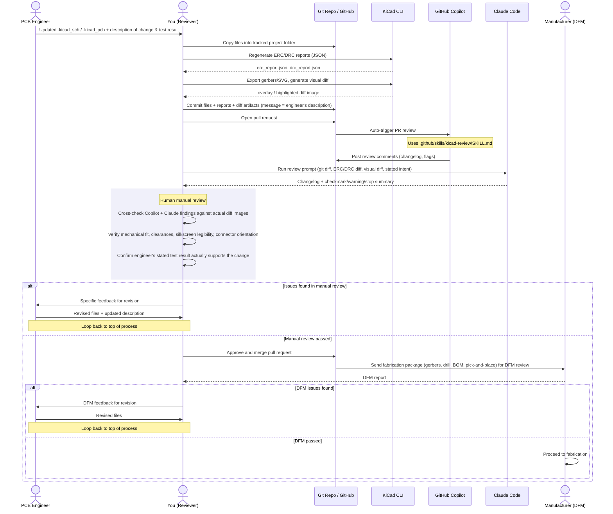

# XTEC UC-IP Main PCB

KiCad hardware repo for the UC-IP main PCB (currently: IOB board family). This README documents the review-and-release process used to get a schematic/PCB change from an engineer's desk to fabrication.

## Toolchain

- **KiCad CLI**, run via Docker (no local KiCad install required):

  ```bash
  docker pull kicad/kicad:10.0.4

  alias kicad-cli-docker='docker run --rm -v "$(pwd)":/work -w /work kicad/kicad:10.0.4 kicad-cli'
  ```

  Run from inside the board's project folder (e.g. `IOB/`) so relative paths resolve. The container runs as uid 1000, so output files come back owned by your normal user — no `chown` needed on a typical single-user Linux dev machine.

- **GitHub Copilot** — auto-reviews every PR that touches `.kicad_sch` / `.kicad_pcb` files, following the checklist in [.github/skills/kicad-review/SKILL.md](.github/skills/kicad-review/SKILL.md). Copilot refuses to review a PR once it exceeds ~20,000 changed lines, so keep raw Gerber/generated diffs out of the PR (see [Repo conventions](#repo-conventions) and `.gitattributes`/`.gitignore`) — Copilot should only ever be diffing the `.kicad_sch`/`.kicad_pcb` source and small docs.
- **Claude Code** — run manually against the PR (diff, ERC/DRC delta, visual diff, stated intent) as a second automated pass before human sign-off. Unlike Copilot's PR review, Claude Code isn't limited by the PR's line count, so it can be pointed at the full local diff (including the raw gerber comparison) even when Copilot can't review the PR at all.

## Review process

Every hardware change goes through the same loop: engineer submits → automated checks (Copilot + Claude) → human manual review → merge → DFM with the manufacturer. Either automated or manual review failing sends it back to the engineer; either automated or manual review passing is necessary but not sufficient — a human always signs off before merge, and DFM issues after merge also loop back.



### Step by step

1. **Engineer submits a change.** Updated `.kicad_sch` / `.kicad_pcb` files plus a description of what changed, why, and what they tested.
2. **Reviewer stages the files** in the tracked project folder (`IOB/`, alongside the versioned filenames like `IOB_v3.2.1.kicad_pcb`).
3. **Regenerate reports via `kicad-cli`** (see [Toolchain](#toolchain)) into `IOB/Deliverables/`:
   ```bash
   cd IOB/
   kicad-cli-docker sch erc IOB_v3.2.1.kicad_sch -o Deliverables/ERC_report.rpt
   kicad-cli-docker pcb drc IOB_v3.2.1.kicad_pcb -o DRC_report.rpt
   ```
4. **Export gerbers/drill and build a visual diff** (before vs. after) into `IOB/Gerber/` and `changelog/`:
   ```bash
   kicad-cli-docker pcb export gerbers IOB_v3.2.1.kicad_pcb -o Gerber/
   kicad-cli-docker pcb export drill IOB_v3.2.1.kicad_pcb -o Gerber/
   ```
   Old-vs-new gerber pairs for the visual diff go in `changelog/gerber_<new>_v.<old>/` (e.g. `changelog/gerber_v3.2.1_v.3.2.0/`), named `<Layer>_old.pho` / `<Layer>_new.pho`. **This folder is gitignored** — it's regenerable, and each file can run 100K+ lines, which is what blows a PR past Copilot's review cap. Zip it (e.g. `Gerber_old_vs_new.zip`) and attach the zip to the PR instead of committing the raw files — see [changelog/README.md](changelog/README.md).
5. **Update the changelog and peer checklist** in `changelog/` (`Changelog X1-<board> <date>.xlsx`, `Internal Peer Checklist - X1_<board>.xlsx`) — these are small and stay tracked in git.
6. **Commit and open a PR** using the [PR template](.github/PULL_REQUEST_TEMPLATE.md) — fill in the summary, testing, and files-changed checklist. Attach ERC/DRC reports and the zipped visual diff.
7. **Copilot auto-reviews** the PR using [.github/skills/kicad-review/SKILL.md](.github/skills/kicad-review/SKILL.md) — posts a plain-English changelog and flags.
8. **Run Claude Code** against the PR (diff + ERC/DRC delta + visual diff + stated intent) for a second changelog and a ✅/⚠️/🛑 summary.
9. **Human manual review** — cross-check both automated reviews against the actual diff images, verify mechanical fit/clearances/silkscreen/connector orientation, and confirm the stated test result actually supports the change.
10. **Merge or send back.** Issues found → specific feedback to the engineer, loop back to step 1. Passed → approve and merge.
11. **DFM with the manufacturer.** Send the fabrication package (`IOB/Gerber/` + BOM from `IOB/Deliverables/`, plus pick-and-place). DFM issues → feedback to the engineer, loop back to step 1. DFM passed → proceed to fabrication.

## Repo conventions

- Each board family lives in its own top-level folder (e.g. `IOB/`) containing the KiCad project. Version is carried in the filenames (`IOB_v3.2.1.kicad_pcb`, `IOB_v3.2.1.kicad_sch` + numbered sheet files), not the folder name — the folder itself stays unversioned across revisions.
- `IOB/Deliverables/` holds generated exports for the current revision: PDF schematic print, BOM, ERC report, and the PCB↔schematic sync reports.
- `IOB/Gerber/` holds the current revision's fabrication output (gerbers + drill files).
- Top-level `changelog/` holds cross-revision artifacts: the changelog workbook and internal peer review checklist (tracked in git), plus `gerber_<new>_v.<old>/` folders with old/new gerber pairs for visual diffing (**not** tracked — see [changelog/README.md](changelog/README.md)).
- `IOB/.history/` (KiCad's own local file-history backups) is gitignored — it's not project history, git is. Never commit it.
- PR titles/descriptions should describe the *engineering* change and test result, not just "updated PCB" — both Copilot and Claude review against the stated intent, so a vague description gets flagged rather than rubber-stamped.
- Every PR touching `.kicad_sch` or `.kicad_pcb` should include regenerated ERC/DRC reports so reviewers can diff violations before vs. after.
- Keep PRs under Copilot's ~20,000-changed-line cap: commit only source files (`.kicad_sch`, `.kicad_pcb`) and small generated reports/docs. Raw Gerber diff folders and `.history/` must never be committed (enforced by `.gitignore`); if a PR still exceeds the cap, rely on Claude Code's manual review pass and human review — Copilot review becomes best-effort only for oversized PRs.
